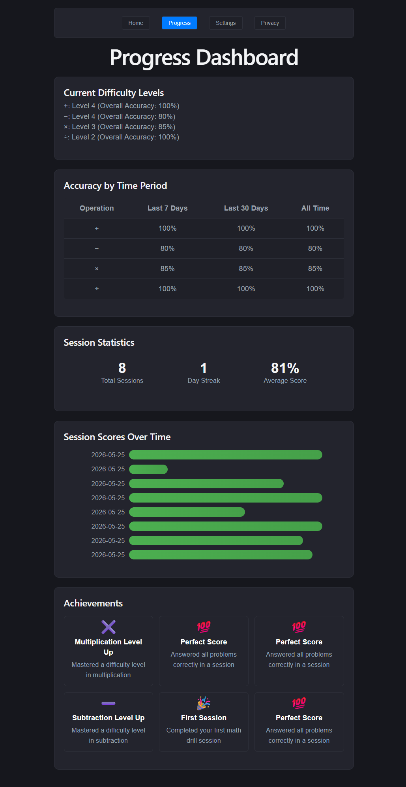
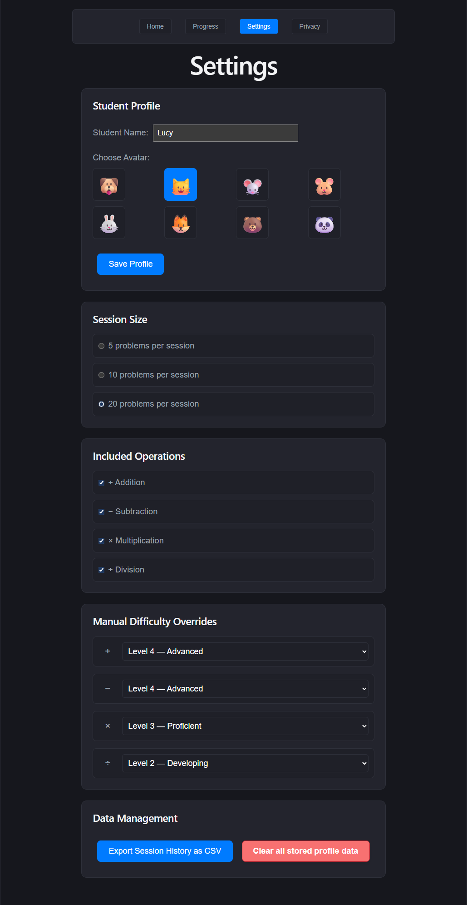

# Math Drills

Math Drills is a web-based arithmetic practice app built for early learners. It delivers adaptive addition, subtraction, multiplication, and division problems, tracks student progress, and includes a simple parent dashboard.






## Features

- Create a student profile with name and avatar
- Adaptive math drills for addition, subtraction, multiplication, and division
- Session summaries with score and performance feedback
- Local progress tracking and history
- Responsive UI for desktop and tablet devices
- Static deployment ready (e.g. GitHub Pages)

## Tech Stack

- React 19
- TypeScript
- Vite
- ESLint
- gh-pages for static deployment

## Getting Started

1. Install dependencies:
   ```bash
   npm install
   ```
2. Start local development:
   ```bash
   npm run dev
   ```
3. Open the app in your browser:
   ```
   http://localhost:5174
   ```

## Available Scripts

- `npm run dev` — start the Vite development server
- `npm run build` — build the application for production
- `npm run preview` — preview the production build locally
- `npm run lint` — run ESLint on the source tree
- `npm run deploy` — build and deploy the `dist` folder with `gh-pages`

## Deployment

This project can be deployed as a static site. The current `npm run deploy` script uses `gh-pages` to publish the production build from `dist`.

## Requirements

See [docs/REQUIREMENTS.md](docs/REQUIREMENTS.md) for full functional requirements and user stories.

## Privacy Policy

See [docs/PRIVACY.md](docs/PRIVACY.md) for the privacy policy.


## Project Structure

- `src/` — application source code
- `src/components/` — screen and UI components
- `src/utils.ts` — shared utility helpers
- `src/types.ts` — TypeScript type definitions
- `public/` — static assets
- `docs/` — product and requirements documentation
- `screenshots/` — application screenshots 

## Notes

This repository uses a standard Vite + React + TypeScript setup.

If you want to extend linting rules for a production-ready app, update `eslint.config.js` to enable type-aware rules and React-specific plugin configurations.
